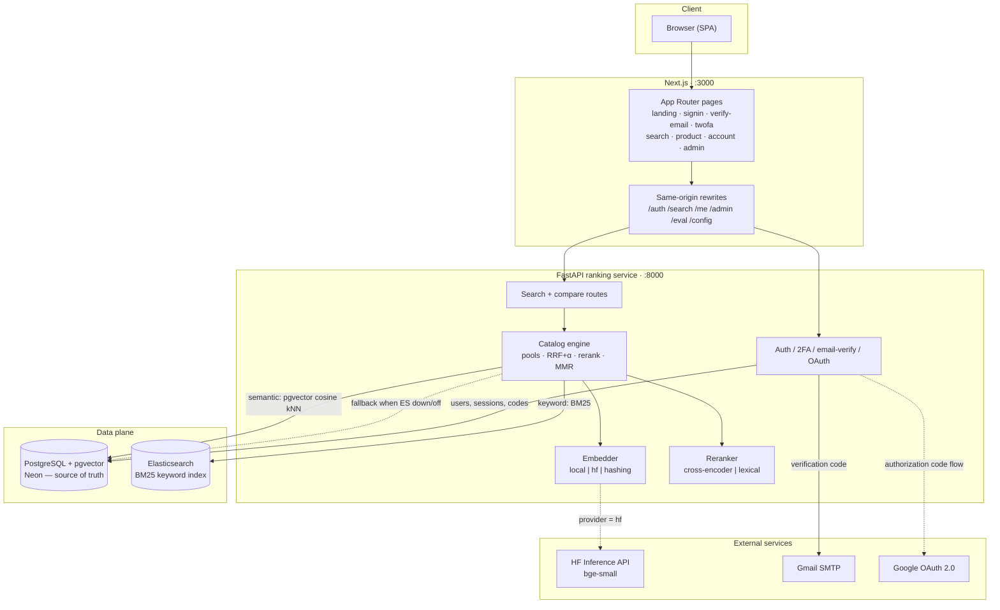
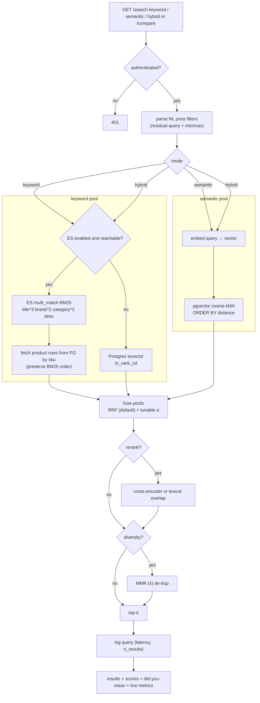
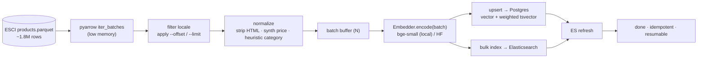
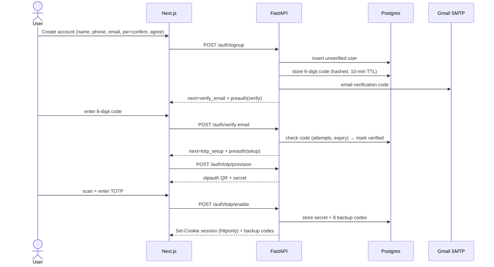
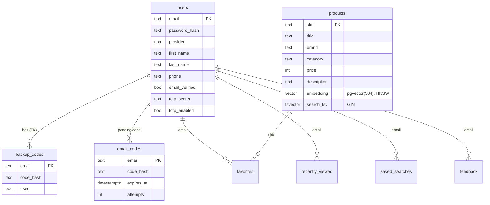
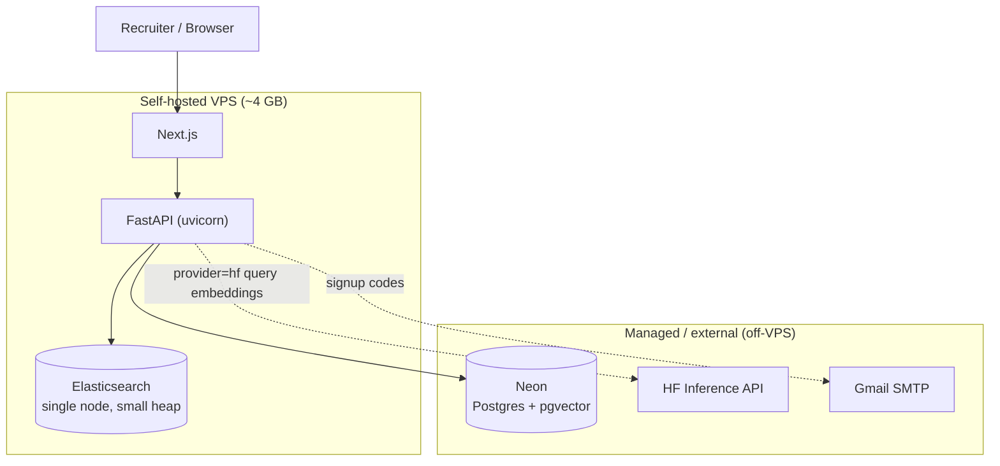

# Architecture

System design for Semvex **as built**. PostgreSQL + pgvector is the single
source of truth; Elasticsearch is an optional BM25 ranker (with a Postgres
`tsvector` fallback); query embeddings come from a local model, the HuggingFace
Inference API, or a hashing fallback.

## 1. System Design

### 1.1 Component architecture

### 1.2 Query-time search flow

### 1.3 Ingestion pipeline (offline, streaming)

### 1.4 Signup → verification → 2FA (auth sequence)

### 1.5 Data model (Postgres)

### 1.6 Deployment topology

> Keyword search is rebuilt from Postgres into Elasticsearch, never maintained
> independently — Postgres stays the source of truth, so there's no sync drift.

## 2. Components

### 2.1 Frontend (Next.js + TypeScript, `frontend/`)
- App-router pages: landing, `/signin` (create account), `/verify-email`, `/twofa`, `/search`, `/product/[sku]`, `/account`, `/admin`.
- Mode toggle (Keyword / Semantic / Hybrid) + **Compare** view showing all three side by side with relevance scores; tunable α slider; filters; live metrics; feedback.
- Rewrites in `next.config.mjs` proxy `/auth/*`, `/search/*`, `/me/*`, `/admin/*`, `/eval/*`, `/config`, `/health` to FastAPI so the browser is single-origin and the session cookie stays same-origin.

### 2.2 Ranking / search service (FastAPI, `app/`)

| Area | Endpoints |
|---|---|
| Search | `GET /search/{keyword,semantic,hybrid}`, `/search/compare` (`?alpha=&rerank=&diversity=&category=&brand=&min_price=&max_price=`) |
| Auth | `/auth/signup`, `/auth/login`, `/auth/verify-email` (+ `/resend`), `/auth/totp/{provision,enable,verify}`, `/auth/google/{start,callback}`, `/auth/logout`, `/auth/me` |
| Discovery | `/suggest`, `/product/{sku}`, `/facets`, `/browse` |
| Account | `/me/{favorites,recently-viewed,saved-searches}` |
| Signals | `/feedback`, `/click` |
| Admin / eval / meta | `/admin/analytics`, `/eval/{labels,live}`, `/health`, `/config` |

Responsibilities: query-time embedding (`app/catalog.py::Embedder`), keyword pool via ES or `tsvector`, pgvector cosine kNN, RRF+α hybrid fusion, cross-encoder/lexical rerank, MMR diversity, NL price parsing, did-you-mean, autocomplete.

### 2.3 Data layer

**PostgreSQL + pgvector** (`app/db.py`) — the single source of truth. Managed via Neon (`DATABASE_URL`); the extension is auto-created on first connect. Tables: `users`, `backup_codes`, `email_codes`, `favorites`, `recently_viewed`, `saved_searches`, `feedback`, `query_log`, `click_log`, and `products` (`embedding vector(384)` HNSW + `search_tsv` GIN).

**Elasticsearch** (`app/search_es.py`) — optional BM25 keyword engine. English analyzer on text fields; `keyword` sub-fields on brand/category for exact filters; a pure ranker returning SKUs+scores (rows are read back from Postgres). Falls back to `tsvector` when unreachable. Pin `elasticsearch>=8,<9` to match an ES 8.x server.

### 2.4 Embeddings (`app/catalog.py::Embedder`)
`SEMVEX_EMBEDDING_PROVIDER = auto|local|hf|hashing`. `local` = sentence-transformers bge-small (bulk ingestion); `hf` = HF Inference API (low-RAM serving); `hashing` = stateless fallback. local and hf are both bge-small (384-d) and interchangeable — embed the catalog locally once, serve live queries via HF.

### 2.5 Ingestion (`app/ingest.py`, `app/ingest_esci.py`)
Sample seed on first boot; the ESCI pipeline streams the products parquet in pyarrow record batches, normalizes, batch-embeds, and writes pgvector + Elasticsearch. Idempotent (upsert by SKU), resumable (`--offset`).

### 2.6 Evaluation harness (`eval/evaluate.py`)
Runs the labeled query set through all three paths and reports Recall@K / MRR / NDCG@K — the portfolio proof point. The same labels power the live NDCG overlay in the search UI.

## 3. Data flow

**Ingestion (offline):** ESCI parquet → clean/normalize → embed (batched) → upsert Postgres (vector + tsvector) → bulk-index Elasticsearch → refresh.

**Query (online):** user query → Next.js proxy → FastAPI → (embed query for semantic) + (BM25 keyword via ES or tsvector) → pgvector kNN + keyword pool → RRF+α fuse → optional rerank → optional MMR → top-k → log → render.

## 4. Why FastAPI is separate from Next.js
- The same embedding/ranking code path serves the live API **and** the offline eval harness — no duplication between "demo" and "proof".
- Next.js stays a thin presentation layer (proxy + UI).
- Legible three-tier story for a walkthrough: frontend / ranking service / data layer.
